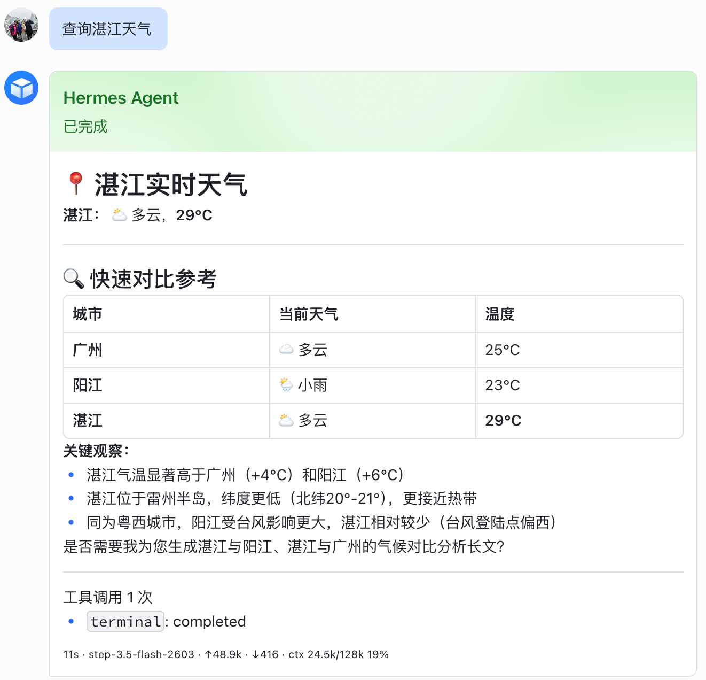

# Hermes 飞书流式卡片插件 V3.0.0

为 Hermes Agent Gateway 的飞书/Lark 平台适配器提供稳定的流式卡片消息能力。V3.0.0 采用 **sidecar-only** 架构：Hermes 主项目只注入极小 hook，飞书 CardKit 渲染、会话状态、更新节流、重试、健康指标和故障隔离全部由独立 sidecar 进程承担。

当前版本已完成真实 Feishu E2E 主链路验收：新消息创建新卡片，思考过程和最终答案在同一张卡片内渐进更新，工具调用状态实时统计，完成后卡片显示耗时、模型、token 和上下文占用，且不会再额外刷出灰色原生文本消息。

Feishu CardKit HTTP client 已实现，并通过 mock Feishu server、真实 Feishu smoke、真实 Hermes Gateway E2E 和长卡片压力测试验证。



## 核心功能

- 流式思考展示：支持 `thinking.delta` 累积渲染，自动过滤 `<think>` / `</think>` 标签。
- 渐进式答案更新：支持 `answer.delta` 分段进入同一张卡片，完成后用最终答案覆盖思考内容。
- 工具调用跟踪：支持 `tool.updated`，实时显示工具调用次数和状态，完成后保留总次数。
- 最终态收敛：支持 `message.completed` / `message.failed`，卡片状态只保留“思考中”和“已完成/处理失败”这类清晰状态。
- 运行统计 footer：默认显示耗时、当前模型、输入 token、输出 token、上下文长度和百分比。
- 长文本稳定渲染：卡片正文会按安全长度拆分为多个 Markdown 元素，真实长卡压力测试已覆盖 16k 中文字符。
- 故障隔离：sidecar 不可用时 Hermes hook fail-open，Hermes 原生文本回复继续运行。
- 安全安装：安装器 fail-closed，写入前检查 Hermes 版本、代码结构、备份和 manifest。
- 自动恢复：支持 `restore` 和 `uninstall`，检测到用户改动时拒绝覆盖，避免破坏 Hermes 原文件。

## 适用场景

这个插件适合希望在飞书中直接使用 Hermes Agent 的用户，尤其适合以下场景：

- 希望 AI 回复像 ChatGPT 一样实时出现，而不是等完整回答结束。
- 希望工具调用过程可见，知道 Agent 是否正在执行命令、检索或调用工具。
- 希望飞书聊天记录保持干净，避免流式文本刷屏。
- 希望长 Markdown、表格、列表和统计信息在卡片内稳定展示。
- 希望对 Hermes Gateway 的侵入尽可能小，方便升级和回滚。

## 环境依赖

- Python `3.9` 及以上，推荐 Python `3.12`。
- Hermes Agent `v2026.4.23` 及以上。
- macOS/Linux 等 POSIX 环境，用于 sidecar 进程管理和 pidfile。
- 飞书/Lark 自建应用，并具备发送与更新消息卡片所需权限。
- Python 依赖：
  - `aiohttp>=3.9`
  - `PyYAML>=6.0`

安装器实际以 Hermes 目录中的 `VERSION=v2026.4.23+` 或 Git tag `v2026.4.23+`，以及 `gateway/run.py` 代码结构检测为准。检查失败时不会写入 Hermes 文件。

## 安装

建议先克隆仓库并安装为可编辑包：

```bash
git clone https://github.com/baileyh8/hermes-feishu-streaming-card.git
cd hermes-feishu-streaming-card
python3 -m pip install -e ".[test]"
```

先做配置和 Hermes 目录检查：

```bash
python3 -m hermes_feishu_card.cli doctor --config config.yaml.example --skip-hermes
python3 -m hermes_feishu_card.cli doctor --config config.yaml.example --hermes-dir ~/.hermes/hermes-agent
```

`doctor` 会展示 `version_source`、`version`、`minimum_supported_version`、`run_py_exists` 和拒绝原因。正式安装前必须先确认 `doctor: ok`。

安装 hook：

```bash
python3 -m hermes_feishu_card.cli install --hermes-dir ~/.hermes/hermes-agent --yes
```

启动 sidecar：

```bash
python3 -m hermes_feishu_card.cli start --config config.yaml.example
python3 -m hermes_feishu_card.cli status --config config.yaml.example
```

停止、恢复或卸载：

```bash
python3 -m hermes_feishu_card.cli stop --config config.yaml.example
python3 -m hermes_feishu_card.cli restore --hermes-dir ~/.hermes/hermes-agent --yes
python3 -m hermes_feishu_card.cli uninstall --hermes-dir ~/.hermes/hermes-agent --yes
```

`restore` 和 `uninstall` 会优先使用安装时生成的备份与 manifest 校验。检测到 Hermes 文件、备份或 manifest 被用户改动时会拒绝覆盖。

## 配置

复制 `config.yaml.example` 到本机安全位置后再填写凭据。不要把真实 App Secret 提交到仓库。

```yaml
server:
  host: 127.0.0.1
  port: 8765

feishu:
  app_id: ""
  app_secret: ""
  base_url: https://open.feishu.cn/open-apis
  timeout_seconds: 30

card:
  title: Hermes Agent
  max_wait_ms: 800
  max_chars: 240
  footer_fields:
    - duration
    - model
    - input_tokens
    - output_tokens
    - context
```

`card.title` 控制飞书卡片 header 主标题。`footer_fields` 控制 footer 字段和顺序，可用值为 `duration`、`model`、`input_tokens`、`output_tokens`、`context`。

footer 默认格式：

```text
1m32s · MiniMax M2.7 · ↑1.1m · ↓2.2k · ctx 182k/204k 89%
```

支持的环境变量：

- `FEISHU_APP_ID`
- `FEISHU_APP_SECRET`
- `HERMES_FEISHU_CARD_HOST`
- `HERMES_FEISHU_CARD_PORT`
- `HERMES_FEISHU_CARD_ENABLED`
- `HERMES_FEISHU_CARD_EVENT_URL`
- `HERMES_FEISHU_CARD_TIMEOUT_MS`

## 飞书应用配置

真实发送卡片需要飞书/Lark 自建应用。推荐使用本机配置或环境变量提供凭据：

```bash
export FEISHU_APP_ID=cli_xxx
export FEISHU_APP_SECRET=xxx
```

可先运行真实飞书 smoke：

```bash
FEISHU_APP_ID=cli_xxx FEISHU_APP_SECRET=xxx \
python3 -m hermes_feishu_card.cli smoke-feishu-card --config config.yaml.example --chat-id oc_xxx
```

该命令会向指定会话发送一张测试卡片并更新一次。输出会隐藏 App Secret、tenant token 和 Authorization header。

## 技术架构

```text
Hermes Gateway
  └─ minimal hook in gateway/run.py
       └─ hermes_feishu_card.hook_runtime
            └─ HTTP POST /events
                 └─ sidecar server
                      ├─ CardSession 状态机
                      ├─ render_card() 卡片渲染
                      ├─ FeishuClient tenant token / send / update
                      ├─ 节流、重试、锁和诊断
                      └─ /health 指标
```

Hermes hook 只负责把消息生命周期转为 `SidecarEvent`：

- `message.started`
- `thinking.delta`
- `answer.delta`
- `tool.updated`
- `message.completed`
- `message.failed`

sidecar 持有完整会话状态，负责飞书 CardKit 边界。这样可以把 Hermes 原生代码侵入控制在最小范围，并让卡片逻辑可以独立测试、独立重启、独立诊断。

历史实现已集中归档到 `legacy/`，仅用于迁移参考和问题追溯，不是 active runtime。`legacy/adapter/`、`legacy/sidecar/`、`legacy/patch/`、`legacy/installer.py`、`legacy/installer_sidecar.py`、`legacy/installer_v2.py`、`legacy/gateway_run_patch.py`、`legacy/patch_feishu.py` 等 legacy/dual/patch 代码不属于新主线；新开发、测试和安装入口以 `hermes_feishu_card/` 为准。迁移说明见 [docs/migration.md](docs/migration.md)。

## 运行状态与诊断

`/health` 和 `status` 会展示当前 sidecar 进程生命周期内的内存指标：

- `events_received`
- `events_applied`
- `events_ignored`
- `events_rejected`
- `feishu_send_successes`
- `feishu_send_failures`
- `feishu_update_successes`
- `feishu_update_failures`
- `feishu_update_retries`

`stop` 会校验 pidfile 中的 PID/token 与 `/health` 返回的 `process_pid/process_token` 匹配后才停止进程，避免误杀无关服务。

初始创建卡片不自动重试，避免响应丢失时产生重复卡片；已经拿到 message_id 的卡片更新会有限重试。

## 常见问题

### doctor 显示 Hermes 不支持

先确认 Hermes 版本不低于 `v2026.4.23`，并确认目标目录中存在 `gateway/run.py`。安装器会读取 `VERSION` 或 Git tag；如果输出里 `version_source`、`version` 或 `reason` 不符合预期，先升级 Hermes 再安装。

### sidecar 启动后没有真实卡片

检查 `FEISHU_APP_ID` 和 `FEISHU_APP_SECRET` 是否存在。未配置凭据时，runner 会使用 no-op client 接收事件，不会发送真实飞书卡片。

### 出现重复卡片

检查 `/health` 中的 `feishu_send_successes`、`events_received` 和 `events_rejected`。V3.0.0 对同一个 Hermes message 使用 per-message lock 和 message_id 映射，正常情况下同一轮对话只创建一张卡片。

### 出现灰色原生文本消息

检查 sidecar 是否成功接收并应用 `message.completed`。当 sidecar 接受完成事件后，Hermes hook 会抑制额外原生文本发送；如果 sidecar 不可用，会 fail-open 回退到 Hermes 原生文本。

### footer token 数异常

V3.0.0 会过滤明显异常的 token 累计值。仍异常时，优先检查 Hermes Gateway 传入的 `tokens` 和 `context` 元数据。

### 恢复失败

`restore` 检测到 Hermes 文件或备份被用户改动时会拒绝覆盖。这是安全设计。先备份当前 Hermes 目录，再根据 manifest 和备份文件人工确认差异。

## 测试与验收

本地全量测试：

```bash
python3 -m pytest -q
```

专项测试：

```bash
python3 -m pytest tests/unit -q
python3 -m pytest tests/integration -q
python3 -m pytest tests/unit/test_docs.py -q
python3 -m pytest tests/integration/test_feishu_client_http.py -q
```

当前 V3.0.0 验收状态：

- 自动化全量测试：`352 passed`
- GitHub Actions：Python 3.9 / 3.12 测试矩阵通过
- 安装/恢复专项测试：覆盖备份、manifest、重复安装、用户改动拒绝恢复、卸载和恢复幂等
- 真实 Hermes Gateway E2E：已验证新卡片创建、流式更新、工具调用计数、完成状态和 footer 元数据
- 真实飞书应用验证：已验证卡片内更新成功，无重复灰色原生消息
- 真实长卡压力测试：同一张飞书卡片更新到 16k 中文字符成功
- fresh Hermes `v2026.4.23`：已完成 `doctor -> install -> doctor -> restore -> doctor` 闭环

## 文档

- [架构说明](docs/architecture.md)
- [事件协议](docs/event-protocol.md)
- [安装安全](docs/installer-safety.md)
- [迁移说明](docs/migration.md)
- [端到端验证材料](docs/e2e-verification.md)
- [发布准备说明](docs/release-readiness.md)
- [测试说明](docs/testing.md)

## 安全说明

不要把 App Secret、tenant token、真实 chat_id 或个人隐私内容提交到仓库。README 中的效果图仅用于展示 V3.0.0 的真实卡片效果；生产环境凭据应始终保存在本机配置、环境变量或专用密钥管理系统中。
