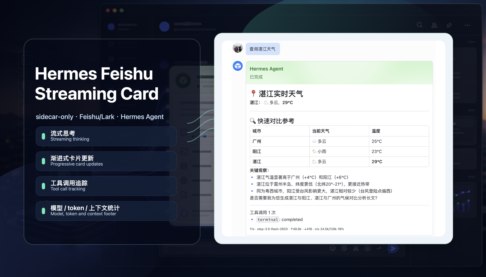
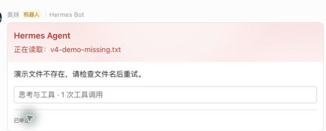
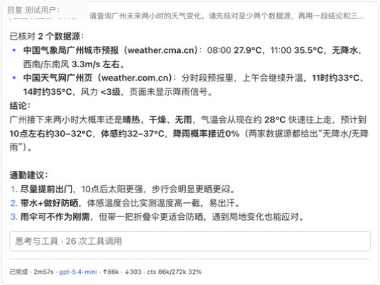

# Hermes 飞书流式卡片插件

[中文](README.md) | [English](README.en.md)
<p align="center">
<a href="https://github.com/baileyh8/hermes-feishu-streaming-card/stargazers"></a> <a href="https://github.com/baileyh8/hermes-feishu-streaming-card/releases"></a> <a href="https://github.com/baileyh8/hermes-feishu-streaming-card/actions/workflows/tests.yml"></a>    <a href="LICENSE"></a>
</p>



**在飞书里，看见 Hermes 正在做什么，直接确认下一步，完整读到最终答案。**

本插件（HFC）把 Hermes Agent Gateway 的飞书/Lark 回复变成持续更新的交互式卡片。普通问答保持原卡；需要审批或澄清时，可以直接点选，后续输出按顺序续答，过程与结果都方便回看。

它适合已经在使用、或准备把 [Hermes Agent](https://github.com/NousResearch/hermes-agent) 接入飞书的用户。模型、工具和任务仍由 Hermes 执行，HFC 负责卡片展示、交互和投递。

[快速安装](#快速安装) · [配置方法](#配置方法) · [近期更新](#近期更新) · [使用手册](docs/user-guide.md) · [贡献者](#贡献者)

## 为什么使用 HFC

| 你关心的事 | 卡片里的体验 |
| --- | --- |
| **知道任务有没有在推进** | 实时显示当前工具动作、过程记录和答案；区分运行、等待、失败与完成 |
| **少打字，也少刷屏** | 审批、澄清支持按钮或表单；系统提示集中展示，减少重复消息 |
| **长回答读得清楚** | 正文与思考/工具过程分区，支持 Markdown、代码和表格；可选阅读预设 |
| **交互前后内容连贯** | 审批后按实际输出创建续答卡，保留此前正文和操作回执 |
| **适配自己的使用方式** | 支持私聊、群聊、话题、多 bot / 多 profile；指定会话可使用原生消息 |
| **出问题有线索** | 提供状态检查、兼容性诊断、安全修复和恢复命令 |

`/model` 与 Hermes CLI 使用同一 Provider/模型列表，按 **Provider → Model** 两级选择；`/resume` 可选择历史会话。页脚可显示模型、耗时、Token 和上下文用量，具体字段取决于 Hermes 提供的数据。

## 看看实际效果

| 运行中：当前动作与过程 | 等待：直接在卡片操作 |
| --- | --- |
|  |  |

<details>
<summary>展开查看失败、完成与命令交互示例</summary>

| 失败：保留已有内容 | 完成：阅读最终答案 |
| --- | --- |
|  |  |


</details>

截图来自已发布版本的真实飞书验收；不同客户端、版本与配置的外观可能不同。

## 快速安装

**准备好：** 已安装的 Hermes Agent、Python 3.9+，以及已接入 Hermes 的飞书/Lark 机器人（App ID / App Secret）。初次接入、权限与环境说明见[安装手册](README-install.md)。

**macOS / Linux**

```bash
curl -fsSL https://raw.githubusercontent.com/baileyh8/hermes-feishu-streaming-card/main/install.sh | bash
```

**Windows PowerShell**

```powershell
irm https://raw.githubusercontent.com/baileyh8/hermes-feishu-streaming-card/main/install.ps1 | iex
```

脚本默认解析最新稳定 Release，安装到 Hermes 使用的环境，读取或提示凭据并写入本地 `.env`，再完成配置、hook 安装和 sidecar 启动。已有包也可手动运行整合安装器（将路径替换为实际路径）：

```bash
python3 -m hermes_feishu_card.cli setup --hermes-dir ~/.hermes/hermes-agent --config ~/.hermes/config.yaml --yes
python3 -m hermes_feishu_card.cli status --config ~/.hermes/config.yaml
python3 -m hermes_feishu_card.cli doctor --config ~/.hermes/config.yaml --hermes-dir ~/.hermes/hermes-agent --explain
```

按安装输出启动或重启 Hermes Gateway，再给机器人发一条消息，确认卡片能从运行态更新到最终答案。`status` 表示服务状态；实际发卡仍需这一步确认。

- **Linux：** systemd user manager 与 linger 就绪时，`setup` 默认启用常驻服务；否则警告后临时启动。`--transient` 可显式选择临时运行。
- **macOS：** 默认临时运行，`enable` 不支持 macOS。登录自启动可自行配置 LaunchAgent，以 `RunAtLoad=true` 执行一次 `start`，不要设置 `KeepAlive=true`。详见[安装安全](docs/installer-safety.md)。
- **Docker：** 在已有 Hermes 容器中，使用仓库内的安装脚本：

```bash
export FEISHU_APP_ID=cli_xxx FEISHU_APP_SECRET=xxx HFC_VERSION=v4.6.9
bash install-docker.sh
```

默认 `HERMES_DIR=/opt/hermes`、`HFC_CONFIG=/opt/data/config.yaml`、`HFC_ENV_FILE=/opt/data/.env`。详见[容器安装](README-install.md)与 [Compose 示例](docker-compose.example.yml)；示例不是官方镜像。

## 配置方法

`setup` 会准备配置。需要手动调整时，参考 [config.yaml.example](config.yaml.example)，编辑安装时选中的 `--config` 文件；不要直接覆盖已有 Hermes 配置。

### 1. 开启 Hermes 流式输出

在 Hermes 配置中设置 `streaming.enabled`，使用 edit transport：

```yaml
streaming:
  enabled: true
  transport: edit
```

不要设置 `display.platforms.feishu.streaming: false`；不要把 `display.show_reasoning` 当作插件必需开关。HFC 直接处理流式思考与答案。

### 2. 配置凭据与卡片

最小配置示例（凭据优先放 `.env`）：

```yaml
server:
  host: 127.0.0.1
  port: 8765
feishu:
  app_id: ""
  app_secret: ""
card:
  title: Hermes Agent
  table_overflow_mode: compact
  footer_fields: [duration, model, input_tokens, output_tokens, context]
bindings:
  native_chats: []
integrity:
  mode: safe
service:
  manager: auto
```

配置同目录的 `.env`：

```dotenv
FEISHU_APP_ID=cli_xxx
FEISHU_APP_SECRET=xxx
FEISHU_CONNECTION_MODE=websocket
FEISHU_HOME_CHANNEL=oc_xxx
```

优先级：YAML < 配置同目录 `.env` < `--env-file` 显式文件 < 进程环境。`setup` / `start --env-file ...` 读取选定文件，不自动回退到全局 `.env`。缺凭据会报告 degraded / noop，不会真正发卡。

### 3. 选择阅读方式（可选）

```yaml
card:
  reading_preset: focused
```

| 预设 | 适合的阅读方式 |
| --- | --- |
| 缺省 / `classic` | 保持现有展示方式，过程面板折叠 |
| `focused` | 重点看答案；思考放在面板，正常完成后精简成功工具行 |
| `detailed` | 展开思考与工具过程，便于追踪任务 |

同层显式字段优先于预设。若从完整示例复制了旧显示开关，预设可能被覆盖；用 `hermes-feishu-card card-config --config <配置路径>` 检查有效值，重启 sidecar 后生效。更多选项见[阅读预设](docs/wiki/reading-presets.md)。

| 想调整什么 | 配置 / 文档 |
| --- | --- |
| 实时思考不进入正文 | `card.stream_thinking_to_body: false` |
| 完成后精简成功工具行 | `card.hide_completed_tool_activity: true`，保留异常工具 |
| 字号、页脚与订阅额度 | `card.text_sizes`、`card.footer_fields`；可选 `subscription_usage` |
| 指定会话使用原生回复 | `bindings.native_chats` 精确匹配；多 profile 在对应 profile 下配置 |
| 多机器人、群聊与 profile | [配置与路由](docs/user-guide.md#配置) |
| 可选 CardKit 流式更新 | [开关与权限要求](docs/wiki/cardkit-streaming.md) |

旧配置缺少 `integrity` 时保持 `notify`，不会静默开启自动修复。完整配置及边界见[安全控制与排障](docs/wiki/v4.1-safety-controls.md)。

## 日常使用与排障

| 入口 | 用途 |
| --- | --- |
| 飞书 `/hfc status` | 查看当前会话与群聊绑定状态 |
| 飞书 `/hfc doctor` | 查看诊断与可用的修复操作 |
| CLI `status` / `doctor --explain` | 核对进程、实际加载版本与 Hermes 兼容性 |
| CLI `card-config` | 查看最终生效的阅读配置及来源 |
| CLI `repair` / `restore` | 按诊断修复可验证状态，或恢复原始受管文件 |
| CLI `start --config ...` / `stop --config ...`，`enable` / `disable` | 分别管理临时 sidecar 与 Linux 常驻服务 |

CLI 命令均以 `hermes-feishu-card` 为前缀，并使用实际配置路径。Hermes 升级后先运行 `doctor --explain`，按诊断给出的命令恢复；不要手改安装目录里的 `gateway/run.py`。兼容性取决于实际源码和能力检测，不只看版本号。

HFC 采用 **sidecar-only** 架构：Hermes 运行任务，安装器管理必要 hook，独立 sidecar 处理卡片状态、投递和更新。更多内容见[使用手册](docs/user-guide.md)、[架构](docs/architecture.md)、[维护 Wiki](docs/wiki/README.md)和[测试说明](docs/testing.md)。

<details>
<summary>More technical documentation / 更多技术文档</summary>

- Architecture / 架构：[中文](docs/architecture.md) · [English](docs/architecture.en.md)
- Event protocol / 事件协议：[中文](docs/event-protocol.md) · [English](docs/event-protocol.en.md)
- Installer safety / 安装安全：[中文](docs/installer-safety.md) · [English](docs/installer-safety.en.md)
- Migration / 迁移：[中文](docs/migration.md) · [English](docs/migration.en.md)
- E2E verification / 端到端验收：[中文](docs/e2e-verification.md) · [English](docs/e2e-verification.en.md)
- Release readiness / 发布检查：[中文](docs/release-readiness.md) · [English](docs/release-readiness.en.md)
- Testing / 测试：[中文](docs/testing.md) · [English](docs/testing.en.md)

</details>

## 近期更新

| 版本 | 重点 |
|---|---|
| [v4.6.9](docs/release-notes-v4.6.9.md) | 群聊并发卡片隔离、紧凑单选按钮与新手 README |
| [v4.6.8](docs/release-notes-v4.6.8.md) | macOS 安装与恢复提示，明确自主管理登录启动和未知进程归属 |
| [v4.6.7](docs/release-notes-v4.6.7.md) | 保留可编辑心跳，紧凑审批按钮与完整正文 |
| [v4.6.6](docs/release-notes-v4.6.6.md) | 审批回执确认后精简重复、运行工具可见与原生通知自动收尾 |
| [v4.6.5](docs/release-notes-v4.6.5.md) | 重启通知持久归属、工具调用去重、可选时间线显示与模型报错去重 |
| [v4.6.4](docs/release-notes-v4.6.4.md) | 首次按钮接线、顺序续答、可选阅读预设与作用域通知清理 |
| [v4.6.3](docs/release-notes-v4.6.3.md) | 实时思考正文开关、工具耗时与中断用量 |
| [v4.6.2](docs/release-notes-v4.6.2.md) | 原生插件共存维护证明与可选终态工具区 |
| [v4.6.1](docs/release-notes-v4.6.1.md) | Hermes 0.21.3 hook、状态撤回和审批展示修复 |
| [v4.6.0](docs/release-notes-v4.6.0.md) | 撤回路由、结构化思考、重试时限与卡片重启恢复 |

更早版本见[历史更新](docs/release-history.md)；完整记录见 [CHANGELOG](CHANGELOG.md) 与 [GitHub Releases](https://github.com/baileyh8/hermes-feishu-streaming-card/releases)。

## 贡献者

感谢每一位提供代码、方案、问题复现与现场验证的贡献者。历史署名与关联 PR / Issue 完整保留在下方。

<details>
<summary>展开全部贡献记录</summary>

- V4.6.9: 感谢 [cainiaozp](https://github.com/cainiaozp) 在 [#348](https://github.com/baileyh8/hermes-feishu-streaming-card/issues/348) 提供群聊并发复现与根因线索；感谢 [mouyong](https://github.com/mouyong) 在 [PR #349](https://github.com/baileyh8/hermes-feishu-streaming-card/pull/349)提供紧凑单选布局实现与测试，保留原始代码作者。

- V4.6.8：感谢 [coder-zhw](https://github.com/coder-zhw) 的 [PR #347](https://github.com/baileyh8/hermes-feishu-streaming-card/pull/347)，提供 macOS 安装、未知 pidfile 与登录启动提示的现场分析、实现和回归测试。
- V4.6.6: 感谢 [mouyong](https://github.com/mouyong) 在 [PR #338](https://github.com/baileyh8/hermes-feishu-streaming-card/pull/338) / [PR #339](https://github.com/baileyh8/hermes-feishu-streaming-card/pull/339) 的通知、阅读与审批方案，以及 [#337](https://github.com/baileyh8/hermes-feishu-streaming-card/issues/337) / [#340](https://github.com/baileyh8/hermes-feishu-streaming-card/issues/340)的现场证据；本版以投递确认、有界清理和保留默认的方式适配，保留真实代码署名。 同时感谢 [tidytorch](https://github.com/tidytorch) 的 [PR #342](https://github.com/baileyh8/hermes-feishu-streaming-card/pull/342) 延迟交互确认修复；保留原作者提交，并补强总等待预算与真实 HTTP 丢响应回归。
- V4.6.4：感谢 [sthnow](https://github.com/sthnow) 在 [#335](https://github.com/baileyh8/hermes-feishu-streaming-card/issues/335) 提供冷启动按钮与交互后排序证据，以及补丁作者 **babypanda** 的 eager-hook 实现；适配部分保留 `Co-authored-by`。感谢 [mouyong](https://github.com/mouyong) 的 [PR #331](https://github.com/baileyh8/hermes-feishu-streaming-card/pull/331) 续答与通知生命周期方案、代码贡献及 [#330](https://github.com/baileyh8/hermes-feishu-streaming-card/issues/330) 提交前验证需求；本轮按子项吸收，不等于整 PR 合并。可选阅读预设继续回应 [jackwude](https://github.com/jackwude) 的 [#328](https://github.com/baileyh8/hermes-feishu-streaming-card/issues/328) 与 [leavrcn](https://github.com/leavrcn) 的 [#333](https://github.com/baileyh8/hermes-feishu-streaming-card/issues/333)。保留以下全部历史贡献记录。
- V4.6.3：感谢 [leavrcn](https://github.com/leavrcn) 的 [#333](https://github.com/baileyh8/hermes-feishu-streaming-card/issues/333) 长思考复现与配置建议；适配 [mouyong](https://github.com/mouyong) 的 [PR #331](https://github.com/baileyh8/hermes-feishu-streaming-card/pull/331) 工具排序、耗时与中断用量实现，保留代码署名；通知撤回等其余改动仍独立审查。
- V4.6.2：感谢 [jackwude](https://github.com/jackwude) 提出 [#328](https://github.com/baileyh8/hermes-feishu-streaming-card/issues/328)，并补记其对 4.6.1 [#329](https://github.com/baileyh8/hermes-feishu-streaming-card/issues/329) 的复现贡献；[mouyong](https://github.com/mouyong) 在 [PR #331](https://github.com/baileyh8/hermes-feishu-streaming-card/pull/331) 提供 `hide_completed_tool_activity` 配置方案。本版仅适配这一功能，保留默认显示并覆盖 completed/failed；#331 其余改动仍待审查。
- V4.6.1：感谢 [mouyong](https://github.com/mouyong) 的 [PR #325](https://github.com/baileyh8/hermes-feishu-streaming-card/pull/325) 与 [#326](https://github.com/baileyh8/hermes-feishu-streaming-card/issues/326) 定位，保留原始提交。
- V4.6.0：感谢 [mouyong](https://github.com/mouyong) 的 [PR #310](https://github.com/baileyh8/hermes-feishu-streaming-card/pull/310) 新增修复及 [#320](https://github.com/baileyh8/hermes-feishu-streaming-card/issues/320) 现场证据；[zhangzq](https://github.com/zhangzq) 提供 [#319](https://github.com/baileyh8/hermes-feishu-streaming-card/issues/319) 结构化思考诊断；[qqqq560204-maker](https://github.com/qqqq560204-maker) 定位 [#323](https://github.com/baileyh8/hermes-feishu-streaming-card/issues/323) 自定义 profile 撤回路由。保留 PR 原作者。
- V4.5.1–V4.5.2：感谢 [mouyong](https://github.com/mouyong) 的 [PR #310](https://github.com/baileyh8/hermes-feishu-streaming-card/pull/310)，以及 #282、#304、#305、#307、#311–#314、#318/#321 的现场反馈、复测及排队结果、心跳撤回修复；[lanx214](https://github.com/lanx214) 的 [Issue #316](https://github.com/baileyh8/hermes-feishu-streaming-card/issues/316) 和 [PR #317](https://github.com/baileyh8/hermes-feishu-streaming-card/pull/317) 提供 Hermes clarify 抽取兼容修复；[qqqq560204-maker](https://github.com/qqqq560204-maker) 与 [7360403-coder](https://github.com/7360403-coder) 在 [Issue #306](https://github.com/baileyh8/hermes-feishu-streaming-card/issues/306) 提供 CardKit 300301 诊断线索。两项 PR 保留原始提交作者，维护者补充安全边界与回归验证。#282 已按报告者意愿关闭，未认定手机问题已修复。

- V4.4.5–V4.4.6: [tidytorch](https://github.com/tidytorch) (#286/#291), [Jentlezhi](https://github.com/Jentlezhi) (#292), [sp960817](https://github.com/sp960817), [Cyber-Yichen](https://github.com/Cyber-Yichen), [shichenshuo-star](https://github.com/shichenshuo-star), [ywarmy](https://github.com/ywarmy) (#288/#294/#296), [7360403-coder](https://github.com/7360403-coder) (#298), [mouyong](https://github.com/mouyong) (#276/#280/#282/#289/#301). 感谢代码、测试和现场证据；保留 #291/#292 原始提交作者身份。
### V4.4.3
- [mouyong](https://github.com/mouyong)：[#268](https://github.com/baileyh8/hermes-feishu-streaming-card/issues/268) 的 multiplex 生产反馈与 [#269](https://github.com/baileyh8/hermes-feishu-streaming-card/issues/269) 的空 timeline 体验建议。#268 尚待报告者真实多 bot 环境复验。
### V4.4.2
- [ywarmy](https://github.com/ywarmy): [#261](https://github.com/baileyh8/hermes-feishu-streaming-card/issues/261), Hermes 0.21 completion-marker report.
- [Ricadre](https://github.com/Ricadre): [#265](https://github.com/baileyh8/hermes-feishu-streaming-card/issues/265), stale integrity migration reproduction.
- [mouyong](https://github.com/mouyong): [#83](https://github.com/baileyh8/hermes-feishu-streaming-card/issues/83), [#263](https://github.com/baileyh8/hermes-feishu-streaming-card/issues/263), [#264](https://github.com/baileyh8/hermes-feishu-streaming-card/issues/264), [#266](https://github.com/baileyh8/hermes-feishu-streaming-card/issues/266), Docker/source-only and multiplex evidence; [#258](https://github.com/baileyh8/hermes-feishu-streaming-card/issues/258), approval readability feedback.
### V4.4.1
- [liooil](https://github.com/liooil)：[PR #257](https://github.com/baileyh8/hermes-feishu-streaming-card/pull/257) 提供 Hermes facade 拆分适配实现；[Clarence-G](https://github.com/Clarence-G)：[PR #251](https://github.com/baileyh8/hermes-feishu-streaming-card/pull/251) 提供话题后续投递、queue/redirect 与 cron 相关修复。原始代码提交和作者身份予以保留。
- [mouyong](https://github.com/mouyong)：[#83](https://github.com/baileyh8/hermes-feishu-streaming-card/issues/83)、[#252](https://github.com/baileyh8/hermes-feishu-streaming-card/issues/252)、[#253](https://github.com/baileyh8/hermes-feishu-streaming-card/issues/253)、[#258](https://github.com/baileyh8/hermes-feishu-streaming-card/issues/258)、[#259](https://github.com/baileyh8/hermes-feishu-streaming-card/issues/259) 的单进程 profile、话题和阅读体验反馈；[shiboyumm](https://github.com/shiboyumm)：[#83](https://github.com/baileyh8/hermes-feishu-streaming-card/issues/83) 最初的配置问题；[Boer2333](https://github.com/Boer2333)：[#250](https://github.com/baileyh8/hermes-feishu-streaming-card/issues/250) 的 provider 展示需求。
- [sp960817](https://github.com/sp960817)：[#254](https://github.com/baileyh8/hermes-feishu-streaming-card/issues/254)、[Kevin32623](https://github.com/Kevin32623)：[#255](https://github.com/baileyh8/hermes-feishu-streaming-card/issues/255)、[shichenshuo-star](https://github.com/shichenshuo-star)：[#256](https://github.com/baileyh8/hermes-feishu-streaming-card/issues/256) 的 Hermes 0.21 兼容性报告；[hnzwx](https://github.com/hnzwx) 与 [leavrcn](https://github.com/leavrcn)：[#254 的复现与兼容性审查](https://github.com/baileyh8/hermes-feishu-streaming-card/issues/254)；[micah928](https://github.com/micah928)：[#73](https://github.com/baileyh8/hermes-feishu-streaming-card/issues/73) 的历史无卡片诊断证据，该环境仍待新版复测。
- Dependabot 提供 [PR #247](https://github.com/baileyh8/hermes-feishu-streaming-card/pull/247) 和 [PR #248](https://github.com/baileyh8/hermes-feishu-streaming-card/pull/248) 的 CodeQL 依赖更新。
- 历史署名补全：[lanx214](https://github.com/lanx214) 在 [Issue #240](https://github.com/baileyh8/hermes-feishu-streaming-card/issues/240) 提供 Linux 复现（[V4.3.7](https://github.com/baileyh8/hermes-feishu-streaming-card/releases/tag/v4.3.7)）；[Lite-G](https://github.com/Lite-G) 报告、复现、测试并实现 [PR #235](https://github.com/baileyh8/hermes-feishu-streaming-card/pull/235) 的 Feishu edit fallback 修复（[V4.3.5](https://github.com/baileyh8/hermes-feishu-streaming-card/releases/tag/v4.3.5)）；[lyp88997](https://github.com/lyp88997) 提供 toast-only `200673` 修复方向及跨环境更新观察（[V4.3.2](https://github.com/baileyh8/hermes-feishu-streaming-card/releases/tag/v4.3.2)）。这些是此前版本的贡献，本轮恢复遗漏的历史署名。

这里同时记录代码、PR 方案、Issue 复现和真实环境复测贡献。GitHub 的 [Contributors](https://github.com/baileyh8/hermes-feishu-streaming-card/graphs/contributors) 图按进入 Git 历史的 commit 统计；只提供 Issue、评论、日志或复测证据的贡献者可能不会出现在图中，但仍在这里保留署名。

- [gischuck](https://github.com/gischuck) - [PR #12](https://github.com/baileyh8/hermes-feishu-streaming-card/pull/12) Accept-Encoding 修复；[PR #76](https://github.com/baileyh8/hermes-feishu-streaming-card/pull/76) 思考与工具 timeline 体验建议与实现探索
- [fengs2021](https://github.com/fengs2021) - [PR #17](https://github.com/baileyh8/hermes-feishu-streaming-card/pull/17) 锁架构优化与更新间隔改进
- [colinaaa](https://github.com/colinaaa) - [PR #87](https://github.com/baileyh8/hermes-feishu-streaming-card/pull/87) WebSocket `interaction.select` clarify/approval 卡片交互支持；[PR #88](https://github.com/baileyh8/hermes-feishu-streaming-card/pull/88) 话题群 `message_id` 复用下第二轮消息新卡片修复；[PR #91](https://github.com/baileyh8/hermes-feishu-streaming-card/pull/91) cron 结果回到飞书话题群原线程的 `thread_id` 路由修复
- [zayn-0101](https://github.com/zayn-0101) - [PR #77](https://github.com/baileyh8/hermes-feishu-streaming-card/pull/77) cron `deliver=origin/all` 路由意图卡片投递修复；[PR #196](https://github.com/baileyh8/hermes-feishu-streaming-card/pull/196) 非阻塞 slash-confirm；[Cassius0924](https://github.com/Cassius0924) - [PR #199](https://github.com/baileyh8/hermes-feishu-streaming-card/pull/199) 多选与自定义回答表单
- [Zanetach](https://github.com/Zanetach) - [PR #84](https://github.com/baileyh8/hermes-feishu-streaming-card/pull/84) / @Zanetach：卡片 progress-status 路由与 `.env` 白名单扩展的 profile 环境支持（V3.9.0）
- [colinaaa](https://github.com/colinaaa) - [PR #93](https://github.com/baileyh8/hermes-feishu-streaming-card/pull/93) 打断任务后将旧卡片可靠收束为终态；[PR #97](https://github.com/baileyh8/hermes-feishu-streaming-card/pull/97) 保留完整完成答案（V3.9.1）
- [wjiemin49-ux](https://github.com/wjiemin49-ux) - [PR #52](https://github.com/baileyh8/hermes-feishu-streaming-card/pull/52) loopback 健康检查代理问题的诊断与修复方向（V3.9.1 采用）
- [colinaaa](https://github.com/colinaaa) - [Issue #94](https://github.com/baileyh8/hermes-feishu-streaming-card/issues/94) 裸 `/resume` 原生会话选择器的需求、交互流程与安全边界（V3.10.0）
- [charles5g](https://github.com/charles5g) / jackmim - [PR #98](https://github.com/baileyh8/hermes-feishu-streaming-card/pull/98) 模型选择回调异步化、原卡片状态更新与 footer 语义色创意；主线实现补充 HTML 转义并保持布局不变（V3.9.1–V3.10.0）
- [tianqiii](https://github.com/tianqiii) - [Issue #107](https://github.com/baileyh8/hermes-feishu-streaming-card/issues/107) Codex 订阅配额 footer 的需求、Hermes 原生接口方案与展示格式（V4.0.2）
- [sthnow](https://github.com/sthnow) - [Issue #110](https://github.com/baileyh8/hermes-feishu-streaming-card/issues/110) Markdown 代码中的 `MEDIA:` 字面量误解析复现、根因与期望边界（V4.0.4）
- [zkyken](https://github.com/zkyken) - [Issue #112](https://github.com/baileyh8/hermes-feishu-streaming-card/issues/112) lark SDK 预绑定 callback 下交互按钮失效的日志、根因线索与修复方向（V4.0.4）
- [ShakuOvO](https://github.com/ShakuOvO) / [blakejia](https://github.com/blakejia) - [Issue #106](https://github.com/baileyh8/hermes-feishu-streaming-card/issues/106) 与 [#111](https://github.com/baileyh8/hermes-feishu-streaming-card/issues/111) 图片回答灰色正文重复的报告、复测与截图（V4.0.1–V4.0.3）；另感谢 [blakejia](https://github.com/blakejia) 在 [#115](https://github.com/baileyh8/hermes-feishu-streaming-card/issues/115) 提供 Gateway venv 旧版本证据、完整升级步骤与复测指标（V4.0.5）；感谢 [nasvip](https://github.com/nasvip) / [hzy](https://github.com/hzy) / [lRoccoon](https://github.com/lRoccoon) 贡献 V4.0.6 的 Hermes 升级恢复复现、background 通知卡片实现，以及 Hermes 0.18.x completion hook 生产诊断与修复；V4.0.7 继续感谢 [nasvip](https://github.com/nasvip) 的 [Issue #125](https://github.com/baileyh8/hermes-feishu-streaming-card/issues/125) systemd/Python 环境完整证据，以及 [hzy](https://github.com/hzy) 的 [PR #124](https://github.com/baileyh8/hermes-feishu-streaming-card/pull/124) 自我改进通知卡片实现与回归测试；V4.0.8 感谢 [zyq2552899783-lgtm](https://github.com/zyq2552899783-lgtm) 报告 [Issue #127](https://github.com/baileyh8/hermes-feishu-streaming-card/issues/127) 的 cron 附件只显示文件名问题；V4.0.9 感谢 [Jasonsun77](https://github.com/Jasonsun77) 在 [Issue #130](https://github.com/baileyh8/hermes-feishu-streaming-card/issues/130) 提供 Linux crash-loop A/B、完整时间线、SDK 版本与上游 reconnect 关联证据
- V3.4–V3.8 历史 PR：感谢 [wzgrx](https://github.com/wzgrx)（PR #30/#35/#36/#38）、[zsfjim](https://github.com/zsfjim)（PR #33）、[atop0914](https://github.com/atop0914)（PR #42）、[0269chaoup](https://github.com/0269chaoup)（PR #49）、[dominofeng-maker](https://github.com/dominofeng-maker)（PR #50）、[coder-zhw](https://github.com/coder-zhw)（PR #51）、[x-giraffee](https://github.com/x-giraffee)（PR #54）、[jackwude](https://github.com/jackwude)（PR #72）与 [bestkxt](https://github.com/bestkxt)（PR #85）提交版本检测、进度事件、cron/话题路由、session 回收、配置、Hermes venv、同步脚本与投递策略方案；感谢 [Thomas0x1f](https://github.com/Thomas0x1f) 的 PR #143 多选交互探索。部分方案由主线以更严格边界重新实现，并非全部逐字合并。
- V4.0.10–V4.0.21：感谢 [tianxia3111](https://github.com/tianxia3111)（Issue #133/#153/#155）、[nasvip](https://github.com/nasvip)（Issue #136）、[ati121](https://github.com/ati121)（Issue #141/#142）与 [Cassius0924](https://github.com/Cassius0924)（Issue #147）提供 compaction、systemd 凭据、工具展示、长任务重复卡片、notice 投递和内容完整性证据。
- V4.1.x：感谢 [shutdown-awa](https://github.com/shutdown-awa)（Issue #157）、[Redeemer-w](https://github.com/Redeemer-w)（Issue #159）、[Cyber-Yichen](https://github.com/Cyber-Yichen)（PR #156）、[wholegale39](https://github.com/wholegale39)（PR #160）、[dake6767](https://github.com/dake6767)（PR #168）、[foras910521-lab](https://github.com/foras910521-lab)（Issue #169）与 [simon881](https://github.com/simon881)（Issue #171）贡献聊天排除、表格截断、systemd、Hermes 新入口、answer-delta、TurnRunner 与 Windows 迁移的方案或现场证据。
- V4.2.x：感谢 [Cassius0924](https://github.com/Cassius0924)（PR #177/#199/#205/#206）、[mslchy](https://github.com/mslchy)（PR #180/#181）、[ati121](https://github.com/ati121)（Issue #187）、[xingdongcai](https://github.com/xingdongcai)（Issue #188）、[Cyber-Yichen](https://github.com/Cyber-Yichen)（Issue #189）、[createpjf](https://github.com/createpjf)（PR #190）、[Crystalxd](https://github.com/Crystalxd)（Issue #192）、[simon881](https://github.com/simon881)（Issue #193）、[jdysya](https://github.com/jdysya)（Issue #197）、[AnyNice](https://github.com/AnyNice)（Issue #198）、[Timeral](https://github.com/Timeral)（Issue #202）、[chinakids](https://github.com/chinakids)（Issue #208）与 [yuqianma](https://github.com/yuqianma)（Issue #183）贡献话题卡、Windows runner、重复交互、终态正文、Hermes 0.20、引用摘要、旧卡收束、plugin-style runtime 与自启动的实现、复现和复测。
- V4.3.x：感谢 [leavrcn](https://github.com/leavrcn)（Issue #210/#211/#212/#221/#237）、[jsuper](https://github.com/jsuper)（Issue #214）、[nasvip](https://github.com/nasvip)（Issue #215/#244）、[mouyong](https://github.com/mouyong)（Issue #217）、[Timeral](https://github.com/Timeral)（Issue #245）、[Cassius0924](https://github.com/Cassius0924)（PR #213/#220/#228）、[PureWhiteWu](https://github.com/PureWhiteWu)（PR #242）与 [L261173157](https://github.com/L261173157)（Issue #222 / PR #223）贡献 Hybrid runtime、交互状态、常驻服务、升级恢复、授权、话题投递、HTTP proxy 与 callback 重试的关键证据或方案；感谢 [saulgoodmanngabriel](https://github.com/saulgoodmanngabriel) 和 [zhangzq](https://github.com/zhangzq) 在 Issue #216 提供真实 Hermes 0.20 / 飞书 WebSocket 点击与流式恢复证据；感谢 [RanHuang](https://github.com/RanHuang) 的 PR #226 揭示 persistent service identity、systemd `WorkingDirectory` 与 tokenless health 对账缺口。
- 另感谢 [Akes119](https://github.com/Akes119)（PR #184）和 [yaoge103](https://github.com/yaoge103)（PR #185/#186）提交完成通知与 interaction identity 的替代实现。相关补丁没有按原样合入，因为会造成重复完成通知或削弱 profile/sequence fencing，但这些探索仍作为公开技术讨论保留。

</details>

参与开发请先阅读 [AGENTS.md](AGENTS.md) 与[测试说明](docs/testing.md)。提交问题时请附 Hermes/HFC 版本、复现步骤及脱敏日志。

## 安全与 License

默认仅监听 `127.0.0.1`。非回环部署需要显式开启与 HMAC 鉴权，并自行配置 TLS；不要提交 App Secret、token、真实聊天标识或未脱敏截图。详见[安装安全](docs/installer-safety.md)。

[MIT License](LICENSE)。

<details>
<summary>可选服务与赞助披露</summary>

[ScrapingAnt](https://scrapingant.com/?ref=zwq4ngy) 是可选网页抓取服务，不是本插件的依赖。此链接为 Affiliate link；符合条件的首次付费订阅可能为项目带来佣金。

</details>
