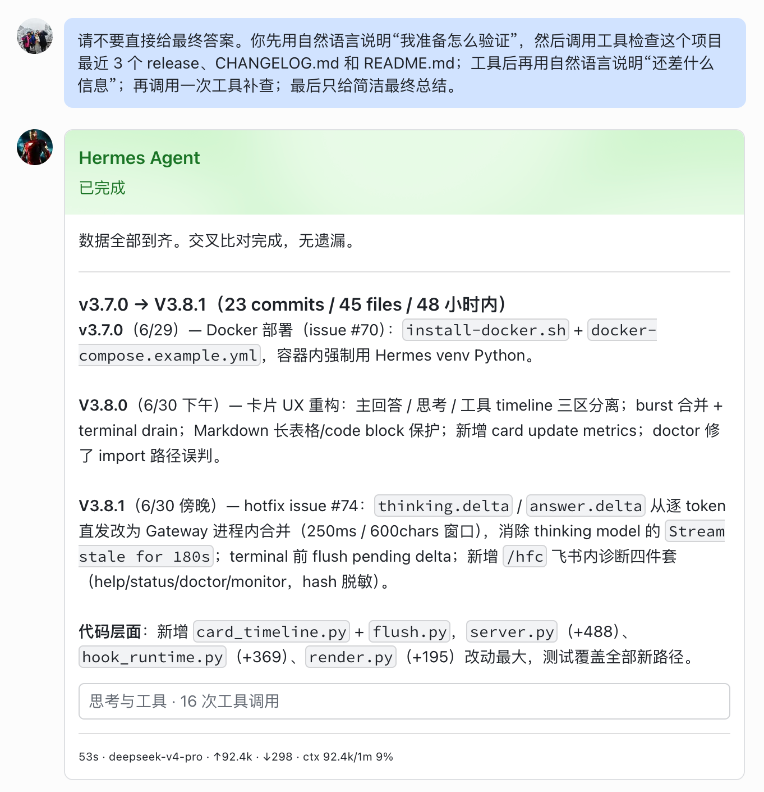
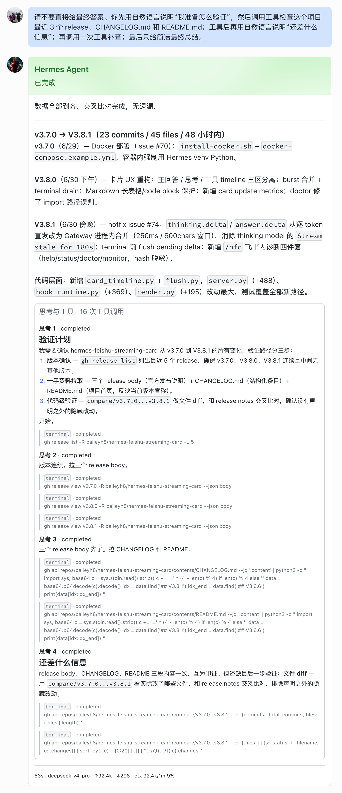

# V3.8.2 版本说明

V3.8.2 是 V3.8 系列的卡片阅读体验补丁。它延续 V3.8.0 的“主回答 + 辅助 timeline”布局和 V3.8.1 的高频 delta 合并能力，重点修正 pre-tool answer 的归档节奏、完成态正文去重，以及“思考与工具”折叠区的视觉层级。

## 真实效果

折叠态：最终答案留在主内容区，timeline 只显示摘要。



展开态：pre-tool answer 与工具调用都在 timeline 中，但使用不同字号和灰度层级，工具详情更弱化。



## 核心修复

- **pre-tool answer 延迟折叠**：工具调用前的自然语言预分析会先停留在正文区，直到下一段预分析或终态到来时，才把上一段归档进“思考与工具”。
- **完成态正文去重**：如果 `message.completed` 的最终答案包含已经归档过的 preface，终态卡片会剥离那部分中间说明，只保留最终答案。
- **raw thinking 不外露**：底层 `thinking.delta` 继续作为内部流式状态，不进入正文区和 timeline；timeline 只展示用户可读的 pre-tool answer。
- **timeline 排版更紧凑**：思考条目使用小字号主层级，工具详情使用更小字号和引用样式，让长命令不会抢主回答的阅读重心。

## 升级

```bash
git checkout v3.8.2
pip install -e ".[test]" --upgrade
python3 -m hermes_feishu_card.cli install --hermes-dir ~/.hermes/hermes-agent --yes
python3 -m hermes_feishu_card.cli stop --config ~/.hermes/config.yaml
python3 -m hermes_feishu_card.cli start --config ~/.hermes/config.yaml
```

Docker 容器内安装/更新：

```bash
export HFC_VERSION=v3.8.2
bash install-docker.sh
```

`docker-compose.example.yml` 的默认示例版本已同步为 `v3.8.2`。

## 验证

本次发布覆盖：

- pre-tool answer 延迟折叠回归测试。
- terminal prefix stripping / 完成态正文去重回归测试。
- raw `thinking.delta` 不进入 timeline 的回归测试。
- 思考与工具 timeline 紧凑排版的渲染测试。
- server / render / e2e preview 断言同步更新。

Release assets:

- `hermes-feishu-card-v3.8.2-macos.tar.gz`
- `hermes-feishu-card-v3.8.2-linux.tar.gz`
- `hermes-feishu-card-v3.8.2-windows.zip`
- `hermes-feishu-card-v3.8.2-checksums.txt`
